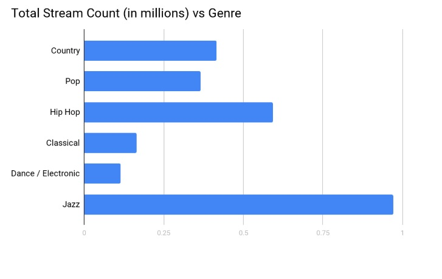
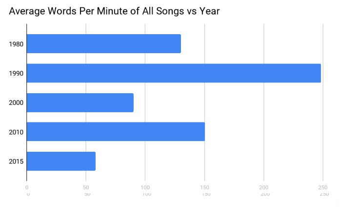
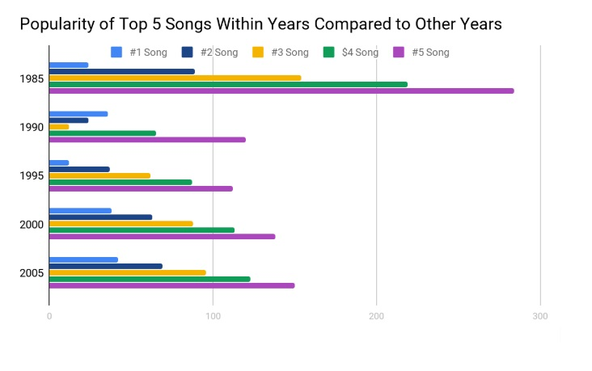
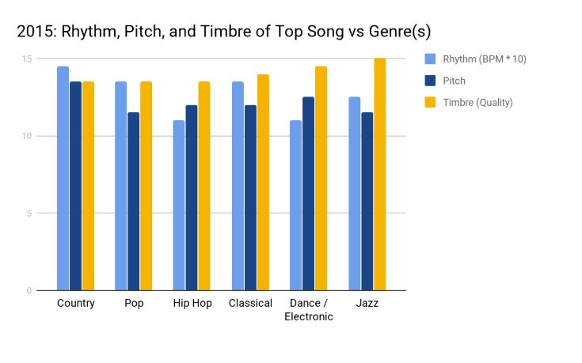

```{r setup, include=FALSE}
knitr::opts_chunk$set(echo = TRUE)
library("knitr")
source("analysis.R")
song_name <- "I Believe I Can Fly"
artist_name <- "R. Kelly"
source("billboard_data.R")
year <- "2015"
present_num <- 5
```

## Problem Domain: Spotify and The Billboard Top 100

Spotify is a digital music service that gives you access to millions of songs, podcasts and videos from artists all over the world. A user can sign up for Spotify Premium for a monthly subscription fee. With _Spotify Free_, a user can play music on shuffle mode and skip up to six times per hour, every hour. Comparatively, with _Spotify Premium_, a user is granted all of this, in addition to features such as ad-free streaming, unlimited skips, extreme quality streaming, and access to Spotify Radio.[^1]

The Billboard Top 100 is the music industry standard record chart in the United States for songs. Chart rankings are based on sales (physical and digital), radio play, and online streaming in the United States. A new chart is compiled and officially released to the public every Tuesday.[^2]

As today's modern world continues to strive for efficiency and quickness, Spotify and the Billboard Top 100 help with reaching these two goals. Streaming allows you to listen to music without having to download files (e.g. MP3, WMA, AAC) from the internet. In other words, with streaming, an individual can start listening to music almost immediately![^3] As a result, we can determine why songs become popular and accumulate a large number of streams by analyzing their rhythm (placement of sounds in time), pitch (the quality that makes it possible to judge sounds as "higher" or "lower") and timbre (the quality of music note or sound that distinguishes different types of musical instruments, or voices). 

## Critical Analysis Questions

#### _Question 1_
How does the average number of words of all songs in 2000 to the year 2010? 

This question is of interest because we can analyze how the average number of words for a songs have changed over the course of years. Our data will support this by using using Billboards data for the top 50 songs for particular years and then plug those songs into spotify to tell us the average number of words. 

#### _Question 2_
How does the average number of words per minute for the years 1980, 1990, 2000, 2010, 2015 compare? Does it increase or decrease? 

This question is of interest because we can compare if songs have increased in "wordiness" which can be correlated to rap music or if it has decreased. Our data sets will support this as we will utilize the popular songs from Billboard's Top 100 and get their average number of words per minute from Spotify. 

#### _Question 3_
How do the top 5 popular songs from the years 1965, 1975, 1985, 1995, 2005 compare from each other?

This question is of interest because we can analyze the trends of users and how the "taste" for music has evolved. From the data we collect, we can assess the popularity of songs using the popularity number. 

#### _Question 4_
How do danceability, energy, loudness, tempo, and valence change from 1980 to 1990?

This question is of interest to analyze themes and motifs among two different, and how similarities of songs rhythm, pitch, and timbre may affect the songs popularity. Our data sets will support this by providing values of danceability, energy, loudness, tempo, and valence from Spotify's audio analysis for a particular song, chosen from Billboards top 100. 

## Data Description: Billboard Top 100 and Spotify

This section focuses on data collected by Billboard, a collection of the most popular U.S songs from 1950 to 2015, as well as their corresponding data (e.g. track name, popularity and duration) from the Spotify data base. 

#### **_First data set: List of Billboard songs_**

This specific data set was collected by Juhee Lee, Yinan Wen, and Kevin Schaich, and can be found [here](https://github.com/kevinschaich/billboard). However, the basis of that data set are the actual Billboard rankings for a given year, which can be found [here](https://www.billboard.com/charts).

Sample of Billboard's Top 100 data set in `r year`:

``` {r billboard data, echo = FALSE}
billboard <- head(get_year(year))
kable(billboard, col.names = c("Song Title", "Artist", "Position", "number of words", "genre"))
```

The table provides:

- **Song title** - The name of the song.
- **Artist** - The person who produced the song.
- **Position** - The songs position (from 1 to 100) on the Billboard Top 100 list in a given year.
- **Number of words** - The number of words, also known as lyrics, the songs contains. 
- **Genre** - The category of artistic, musical, or literary composition characterized by a particular style the song falls in. At times the song can fall into multiple genres which will be presented as c().


#### **_Second data set: Spotify data for a particular song_**

This specific data set was collected by Spotify which can be found [here](https://developer.spotify.com/documentation/web-api/reference/search/search/). We will find the Spotify data for each track in the specific `billboard_data` file.

Here is a sample of the data set for the track "`r song_name`" by `r artist_name`:

```{r spotify data, echo = FALSE}
kable(track_ids(paste(song_name, artist_name)))
```

The table provides:

- **Name** - The name of the song.
- **Duration_ms** - How long (time) the song is presented in milliseconds.
- **Popularity** - Popularity is based on the number of streams. The higher the number of streams is, the more popular that song is.


## Preliminary Analysis: Billboard Top 100 and Spotify

This section focuses on further analyzing each data set, providing descriptive statistics and comparative analysis for major features in data sets. (We only take the first `r present_num` rows of the data as a example from each data set for the first four tables)

#### **First data set: list of Billboard top songs**

The following analysis is about Billboard top `r present_num` songs. The table below is an example of Billboard `r year` top `r present_num` songs, which includes song title, artist name, number of words, and 
genre for each track.

``` {r billboard data1, echo = FALSE}
billboard_songs <- get_year(year) %>% 
  head(present_num)
kable(billboard_songs, col.names = c("Song Title", "Artist", "Year", "Number of Words", "Genre"))
```

#### **Second data set: Spotify data for Billboard `r year` top songs**

The following analysis is about spotify data of Billboard top `r present_num` songs, including the name, duration, popularity (Calculated based on the total number of plays the track has had and how recent those plays are, a value between 0 and 100, with 100 being the most popular), danceability (How suitable a track is for dancing based on a combination of musical elements, measured from 0.0 to 1.0), energy (Perceptual measure of intensity and activity, measured from 0.0 to 1.0), loudness (The overall loudness of a track in decibels, values range between -60 and 0 db), valence (Describing the musical positiveness conveyed by a track, measured from 0.0 to 1.0), and tempo (The overall estimated tempo of a track in beats per minute) of the track.

```{r spotify data1, echo = FALSE}
spotify_year_data <- tracks_audio_features_data(billboard_songs)
spotify_data_summary <- spotify_year_data %>% 
  summarize(avg_popularity = round(mean(popularity)), avg_duration_in_minute = round(mean(duration_ms)/60000, 2), avg_danceability = round(mean(as.numeric(danceability)), 2), avg_energy = round(mean(as.numeric(energy)), 2), avg_loudness = round(mean(as.numeric(loudness)), 2), avg_valence = round(mean(as.numeric(valence)), 2), avg_tempo = round(mean(as.numeric(tempo)), 2))
kable(spotify_year_data)
kable(spotify_data_summary)
```

From two tables provided above, we can see that the top `r present_num` songs has an average popularity of `r pull(spotify_data_summary, avg_popularity)`, an average duration of `r pull(spotify_data_summary, avg_duration_in_minute)` minutes, an average danceability of `r pull(spotify_data_summary, avg_danceability)`, an average energy of `r pull(spotify_data_summary, avg_energy)`, an average loudness of `r pull(spotify_data_summary, avg_loudness)` db, an average valence of `r pull(spotify_data_summary, avg_valence)`, as well as an average tempo of `r pull(spotify_data_summary, avg_tempo)` bpm.

#### Combined data set

The following section is about the combined data sets (Billboard top `r present_num` songs' data combined with their spotify data). We can get the correlation between song's popularity and its audio features (words per second, danceability, energy, loudness, valence, tempo, etc)

```{r combined data, echo = FALSE}
combined_data <- combined_data_frames(billboard_songs) %>% 
  left_join(spotify_year_data, by = c("title" = "name", "duration_ms", "popularity"))
kable(combined_data)
```

What's more, with the combined data, we can also calculate the average popularity of top songs of `r year` and compare it with the other years to get popularity changes over time as well as the other insights on the aggregated data.

### Answers to section 1.1 questions

#### Question 1

For our first question, we asked how the total number of words in songs from one year to the other compare. In the following data table, we show the year in question, as well as the average number of words of each song in the Billboard Top 100 that year. 

```{r question_1, echo=FALSE}
billboard1_10 <- get_year(2010)
billboard1_10_new <- summarize(
  billboard1_10,
    year = mean(year),
  avg_words = mean(num_words)
)
billboard1_15 <- get_year(2015)
billboard1_15_new <- summarize(
  billboard1_15,
    year = mean(year),
  avg_words = mean(num_words)
)
get_avg_words <- rbind(billboard1_10_new, billboard1_15_new, stringsAsFactors = FALSE)
kable(get_avg_words, col.names = c("Year", "Average Number of Words (of songs)"))
```

From the data table, we can see that the average number of words decreased by `r round(max(get_avg_words$avg_words) - min(get_avg_words$avg_words), 2)`. From this, we can conclude that perhaps songs that have less lyrics became more popular from 2010 to 2015.

#### Question 2

For our second question, to sort of build on question 1, we asked how the average number of words per minute changed throughout the years. In the following data table, you can see the year of queried information followed by the average words per second of all the Billboard top 100 songs from that year:

```{r question_2, echo=FALSE}
billboard2_80 <- get_year(1980)
billboard2_80_new <- combined_data_frames(billboard2_80)
billboard2_90 <- get_year(1990)
billboard2_90_new <- combined_data_frames(billboard2_90)
billboard2_00 <- get_year(2000)
billboard2_00_new <- combined_data_frames(billboard2_00)
billboard2_10_new <- combined_data_frames(billboard1_10)
billboard2_15_new <- combined_data_frames(billboard1_15)
billboard2_80_sum <- summarize(
  billboard2_80_new,
  year = mean(year),
  avg_words_sec = mean(num_words / (duration_ms / 1000))
)
billboard2_90_sum <- summarize(
  billboard2_90_new,  
  year = mean(year),
  avg_words_sec = mean(num_words / (duration_ms / 1000))
)
billboard2_00_sum <- summarize(
  billboard2_00_new,
  year = mean(year),
  avg_words_sec = mean(num_words / (duration_ms / 1000))
)
billboard2_10_sum <- summarize(
  billboard2_10_new,
  year = mean(year),
  avg_words_sec = mean(num_words / (duration_ms / 1000))
)
billboard2_15_sum <- summarize(
  billboard2_15_new,
  year = mean(year),
  avg_words_sec = mean(num_words / (duration_ms / 1000))
)
total_avg_words <- rbind(billboard2_80_sum, billboard2_90_sum, billboard2_00_sum, billboard2_10_sum, billboard2_15_sum, stringsAsFactors = FALSE)
kable(total_avg_words, col.names = c("Year", "Average Words per Second (of songs)"))
```

Using the information from this data frame, it's easy to see how the average words per second progress from year to year. There is a pretty strong correlation indicating that as time passes, songs become wordier. This could be happening for a multitude of reasons, but we suspect that the main reason this is happening is the surge of rap and hip-hop music becoming more popular in the past 15 years. In addition, we can also see that there was a slight decline of wordiness from 2010 to 2015, holding with our observation from the previous question that perhaps less wordy songs are making a comeback. 

#### Question 3

Our third question is in regard to how the popularity of songs from certain years compare to songs from other years. In order to do this, we'll use the Spotify metric "Popularity", as applied to the Billboard top 100 lists from a few choice years. The Popularity metric is described as follows: _"The popularity of a track is a value between 0 and 100, with 100 being the most popular. The popularity is calculated by algorithm and is based, in the most part, on the total number of plays the track has had and how recent those plays are.
Generally speaking, songs that are being played a lot now will have a higher popularity than songs that were played a lot in the past."_ In order to answer this, we constructed the following table, containing the years in question, as well as the average Popularity value of all of the Billboard top 100 songs from that year:

```{r question_3, echo=FALSE}
billboard3_80_sum <- summarize(
  billboard2_80_new,
  year = mean(year),
  avg_pop = mean(popularity)
)
billboard3_90_sum <- summarize(
  billboard2_90_new,
  year = mean(year),
  avg_pop = mean(popularity)
)
billboard3_00_sum <- summarize(
  billboard2_00_new,
  year = mean(year),
  avg_pop = mean(popularity)
)
billboard3_10_sum <- summarize(
  billboard2_10_new,
  year = mean(year),
  avg_pop = mean(popularity)
)
billboard3_15_sum <- summarize(
  billboard2_15_new,
  year = mean(year),
  avg_pop = mean(popularity)
)
total_avg_pop <- rbind(billboard3_80_sum, billboard3_90_sum, billboard3_00_sum, billboard3_10_sum, billboard3_15_sum, stringsAsFactors = FALSE)
kable(total_avg_pop, col.names = c("Year", "Average Popularity (of songs)"))
```

Based on the data, we can see that more recent songs have a higher overall popularity based on Spotify's algorithm. This makes a decent amount of sense, as it only seems natural that songs would gradually fade into being less popular after having been around for so many years. 

#### Question 4

For our fourth question, we moved to a more musically intensive point of view. We wanted to see how different musical statistics varied throughout the years. In the following data frame, we analyze numerous musical elements, defined here (definitions provided by the [Spotify API](https://developer.spotify.com/documentation/web-api/reference/tracks/get-several-audio-features/):

- **Danceability** : Danceability describes how suitable a track is for dancing based on a combination of musical elements including tempo, rhythm stability, beat strength, and overall regularity. A value of 0.0 is least danceable and 1.0 is most danceable.
- **Energy** : 	Energy is a measure from 0.0 to 1.0 and represents a perceptual measure of intensity and activity. Typically, energetic tracks feel fast, loud, and noisy. For example, death metal has high energy, while a Bach prelude scores low on the scale.
- **Loudness** : The overall loudness of a track in decibels (dB). Loudness values are averaged across the entire track and are useful for comparing relative loudness of tracks. Values typically range between -60 and 0 db
- **Valence** : A measure from 0.0 to 1.0 describing the musical positiveness conveyed by a track. Tracks with high valence sound more positive (e.g. happy, cheerful, euphoric), while tracks with low valence sound more negative (e.g. sad, depressed, angry).
- **Tempo** : The overall estimated tempo of a track in beats per minute (BPM). In musical terminology, tempo is the speed or pace of a given piece and derives directly from the average beat duration.

```{r question_4, echo=FALSE}
billboard4_80_new <- tracks_audio_features_data(billboard2_80)
billboard4_90_new <- tracks_audio_features_data(billboard2_90)
billboard4_00_new <- tracks_audio_features_data(billboard2_00)
billboard4_10_new <- tracks_audio_features_data(billboard1_10)
billboard4_15_new <- tracks_audio_features_data(billboard1_15)
billboard4_80_sum <- summarize(
  billboard4_80_new,
  year = 1980,
  avg_dance = mean(as.numeric(danceability)),
  avg_energy = mean(as.numeric(energy)),
  avg_loudness = mean(as.numeric(loudness)),
  avg_valence = mean(as.numeric(valence)),
  avg_tempo = mean(as.numeric(tempo))
)
billboard4_90_sum <- summarize(
  billboard4_90_new,
  year = 1990,
  avg_dance = mean(as.numeric(danceability)),
  avg_energy = mean(as.numeric(energy)),
  avg_loudness = mean(as.numeric(loudness)),
  avg_valence = mean(as.numeric(valence)),
  avg_tempo = mean(as.numeric(tempo))
)
billboard4_00_sum <- summarize(
  billboard4_00_new,
  year = 2000,
  avg_dance = mean(as.numeric(danceability)),
  avg_energy = mean(as.numeric(energy)),
  avg_loudness = mean(as.numeric(loudness)),
  avg_valence = mean(as.numeric(valence)),
  avg_tempo = mean(as.numeric(tempo))
)
billboard4_10_sum <- summarize(
  billboard4_10_new,
  year = 2010,
  avg_dance = mean(as.numeric(danceability)),
  avg_energy = mean(as.numeric(energy)),
  avg_loudness = mean(as.numeric(loudness)),
  avg_valence = mean(as.numeric(valence)),
  avg_tempo = mean(as.numeric(tempo))
)
billboard4_15_sum <- summarize(
  billboard4_15_new,
  year = 2015,
  avg_dance = mean(as.numeric(danceability)),
  avg_energy = mean(as.numeric(energy)),
  avg_loudness = mean(as.numeric(loudness)),
  avg_valence = mean(as.numeric(valence)),
  avg_tempo = mean(as.numeric(tempo))
)
total_avg_stats <- rbind(billboard4_80_sum, billboard4_90_sum, billboard4_00_sum, billboard4_10_sum, billboard4_15_sum, stringsAsFactors = FALSE)
kable(total_avg_stats, col.names = c("Year", "Average Danceability", "Average Energy", "Average Loudness", "Average Valence", "Average Tempo"))
```

Using this data, it's easy to see how music has changed throughout the years, with the changes in these statistics reflecting the shifts in popular genres as the years have gone by.

## Proposed Data Presentation

### Visualization One

This visualization expresses and compares the average number of words of all songs in two given years: 2000 and 2010. A bar graph is used to represent this discrete data, and to directly compare the data versus the two years. 




### Visualization Two

This visualization expresses comparisons of average number of words and lyrics per minute of all songs within a year, for a set of years. A bar graph is used to communicate the differences and trends of this average number of words per minute, although a similar representation can be made using a line graph. We chose a bar graph over a line graph because the data is more discrete and not continuous, as a line may suggest; therefore, we thought a bar graph would better represent the data we sought after.  




### Visualization Three

This visualization expresses how the 5 most popular songs in a year compare with other years with their respective top 5 popular songs. This visualization uses a bar graph as well as it easily represents the popularity of a set of years' most popular songs. 




### Visualization Four

This visualization expresses comparison of relative quality (determined by Billboard data set) of two songs in two different time periods. A column graph is utilized here to express comparisons of rhythm, pitch and timbre for the two songs. A column graph is utilized here to express comparisons easily. This visualization also provides a clearer comparison of "energy", which translates to danceability, loudness, and tempo. 




## Reference
[^1]: https://www.pocket-lint.com/apps/news/spotify/139236-what-is-spotify-and-how-does-it-work

[^2]: https://en.wikipedia.org/wiki/Billboard_Hot_100

[^3]: https://www.lifewire.com/what-is-streaming-music-2438445
